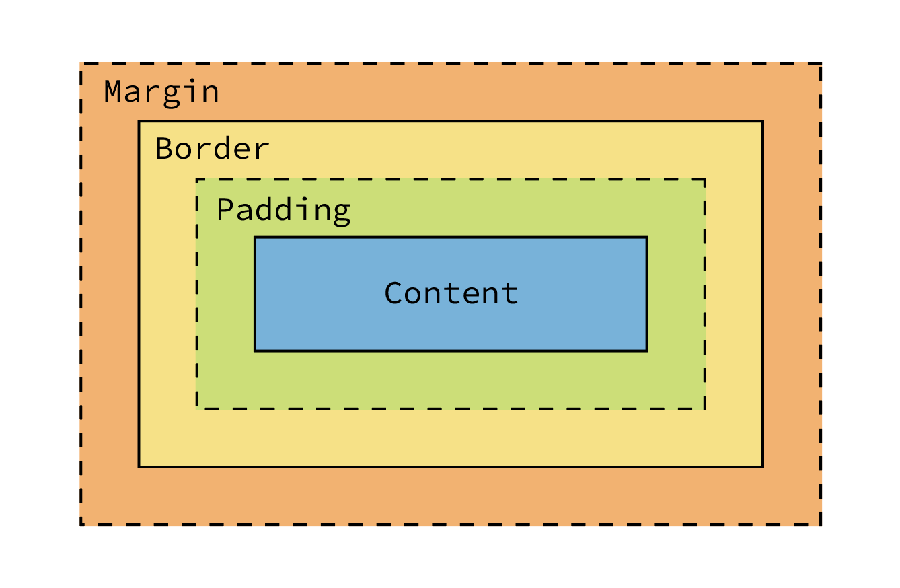

# Css Box Model

>Everything in CSS has a box around it. There are two types of boxes - **block boxes** and **inline boxes**. The full CSS box model applies to block boxes, inline boxes only use some of the behaviour defined in the box model. 

### Block box & Inline box
- **Block box**
  - The width and height properties will be applied.
  - The box will break onto a new line and in most cases, the box will become as wide as its container.
  - Padding, margin and border will cause other elements to be pushed away from the box.
- **Inline box**
  - The width and height properties will not be applied.
  - The box will not break onto a new line.
  - Padding, margin, and border will be applied but vertical padding, margin, and border will not cause other inline boxes to move away from the box.

### Parts of a box

- **Content box** : The area where your content is displayed. It can be sized using `width` and `height`.
  - `box-sizing: content-box` : The `width` and `height` properties will set the width and height of the content box.
  - `box-sizing: border-box` : The `width` and `height` properties will set the width and height of the box area including padding and border.
- **Padding box** : The padding sits around the content as white space.
  - The size of `padding` can be set as a percentage, relative to the **width** of the containing block.
- **Border box** : The border box wraps the content and any padding.
- **Margin box** : The margin is the outermost layer, whitespace between the element and others.
  - The size of `margin` can be set as a percentage, relative to the **width** of the containing block.
  - `margin` can have negative values.
  - `margin: auto` : The browser selects a suitable margin to use. In certain cases, this value can be used to centre an element.
  - **Margin collapsing** : The vertical margins of the adjacent elements collapse into a single margin that is equal to the largest of the two margins. Margin collapsing occurs in 3 cases:
    - Adjacent siblings
    - When there is no border or padding separating parent and descendants. The collapsed margin ends up outside the parent.
    - Empty block

    If one of the margins is negative, the size of the collapsed margin is the sum of the largest positive margin and the smallest negative margin. If all margins are negative, the size of the collapsed margin is the smallest margin. 

  

