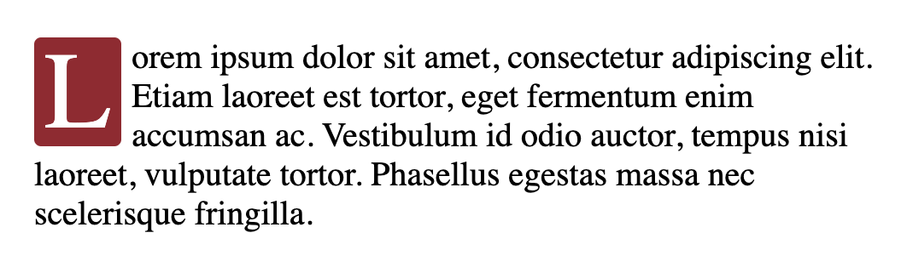

# CSS Selector

>CSS selectors define the elements to which a set of CSS rules apply.

### Universal Selector
- Selects all elements
  ```css
  * { padding: 0; margin: 0; }
  /* It can also select all elements inside another element */
  #container * { border: 1px solid black; }
  ```

### Type Selector
- Selects all elements that have the given node name
  ```css
  h1 { font-size: 64px; }
  ```

### Class Selector
- Selects all elements that have the given class attribute
  ```css
  .blue { color: blue; }
  ```

### ID Selector
- Selects an element based on the value of its id attribute
  ```css
  #chapter-1 { border: 1px solid black; }
  ```

### Attribute Selector
- Selects elements based on the presence or value of a given attribute
  ```css
  /* Select elements with lang attribute */
  div[lang] {
    font-weight: bold;
  }

  /* Select elements with lang attribute & "poem" class */
  div[lang][class="poem"] {
    font-style: italic;
  }

  /* Select <a> elements whose class attribute contains the word "logo" (out of a whitespace-separated list of words) */
  a[class~="logo"] {
    padding: 2px;
  }

  /* Select <a> elements whose class attribute contains at least one occurrence of "logo" within the string. */
  a[class*="logo"] {
    padding: 2px;
  }

  /* Select <a> elements whose class attribute starts with "#" */
  a[href^="#"] {
    background-color: gold;
  }

  /* Select <a> elements whose class attribute ends in ".org" */
  a[href$=".org"] {
    color: green;
  }

  /* Select <div> elements whose class attribute is exactly "zh" or starts with "zh" and followed by an hyphen(-) */
  div[lang|="zh"] {
    color: red;
  }
  ```
  ```html
  <p class="bar foo"> case 1 </p>
  <p class="bax bar"> case 2 </p>
  <p class="barrr"> case 3 </p>
  <p class="bar-foo">case 4</p>

  <!-- ~= : case 1, 2 -->
  <!-- *= : case 1, 2, 3, 4 -->
  <!-- ^= : case 1, 3, 4 -->
  <!-- $= : case 2 -->
  <!-- |= : case 4 -->
  ```

### Combinator
- Explains the relationship between the selectors
  - **Descendant Combinator (space)** : Selects nodes that are descendants of the first element.
  - **Child Combinator (>)** :  Selects nodes that are direct children of the first element.
  - **Adjacent Sibling Combinator (+)** : Selects adjacent sibling (the second element directly follows the first).
  - **General sibling combinator (~)** : Selects siblings that follow the first
  ```html
  <ul>
    <li>
      <p>Item 1</p>
      <ul class="parent">
        <li>Sub-Item A</li>
        <li>Sub-Item B</li>
      </ul>
    </li>
    <li>
      <p>Item 2</p>
      <ul>
        <li>Sub-Item C</li>
        <li class="sibling">Sub-Item D</li>
        <li>Sub-Item E</li>
        <li>Sub-Item F</li>
      </ul>
    </li>
  </ul>
  ```
  ```css
  /* Descendant Combinator */
  ul li { font-style: italic; } 
  /* Select Item 1, 2, Sub-Item A, B, C, D, E, F */

  /* Child Combinator */
  .parent > li { font-style: italic; } 
  /* Select Sub-Item A, B */

  /* Adjacent Sibling Combinator */
  .sibling + li { font-style: italic; } 
  /* Select Sub-Item E */

  /* General Sibling Combinator */
  .sibling ~ li { font-style: italic; } 
  /* Select Sub-Item E, F */
  ```

### Pseudo Selector
- **Pseudo Class** : Selects elements depending on their special state 
  - Frequently used pseudo classes : 
  ```css
  :first-child
  :last-child
  :nth-child(n/even/odd)
  :nth-last-child(n/even/odd) /*  counting from the end. */

  a:link /* not yet been visited */
  a:visited /* already been visited */
  input:checked /* checked or toggled radio, checkbox, option */

  :focus
  :hover
  :active
  
  :not() /* prevents specific items from being selected */
  ```
  ```css
  p:not(.plain) { color: gold; } 
  /* <p> elements that are not in the class `.plain` */
  ```
  
- **Pseudo Element** : Selects specified parts of the selected element or insert content inside the element
  - Frequently used pseudo elements : 
  ```css
  ::before
  ::after
  
  ::first-line
  ::first-letter
  ```
  ```html
  <p>
  Lorem ipsum dolor sit amet, consectetur adipiscing elit. Etiam laoreet est tortor, eget fermentum enim accumsan ac. Vestibulum id odio auctor, tempus nisi laoreet, vulputate tortor. Phasellus egestas massa nec scelerisque fringilla.
  </p>
  ```
  ```css
  p::first-letter {
    float: left;
    margin-right: 6px;
    padding: 2px 6px;
    background-color: #991f2d;
    border-radius: 4px;
    color: white;
    font-size: 64px;
    line-height: 60px;
  }
  ```
  