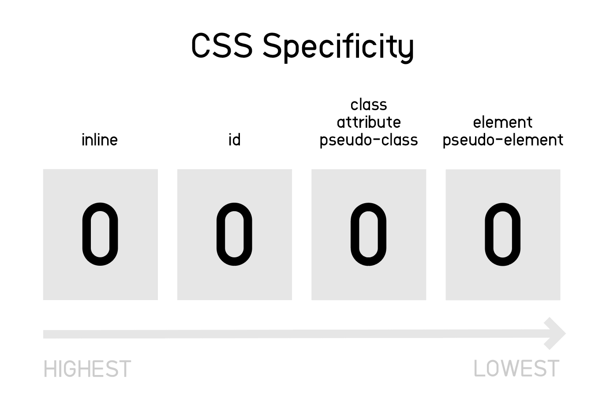

# Specificity

>When the same element is targeted by multiple declarations, the browser decides which style should be applied to the element depending on the specificity.

- How to calculate specificity : 

  - The specificity value of an inline style is 1,0,0,0 (highest)
  - For each ID value, add 1 to the second column 
  - For each class value/attribute selector/pseudo-class, add 1 to the third column
  - For each element/pseudo-element reference, add 1 t0 the fourth column
  - Combinators does not affect the specificity
  - CSS style with !important property ignores the specificity and gains priority 

- Examples :
  ```css
  article > div > .divider { ... } /* 0,0,1,2 */
  div#container a:hover { ... } /* 0,1,1,2 */
  div.dark p.light { ... } /* 0,0,2,2 */
  ```
  ```html
  <p style="color: blue">Text</p> <!-- 1,0,0,0 -->
  ```