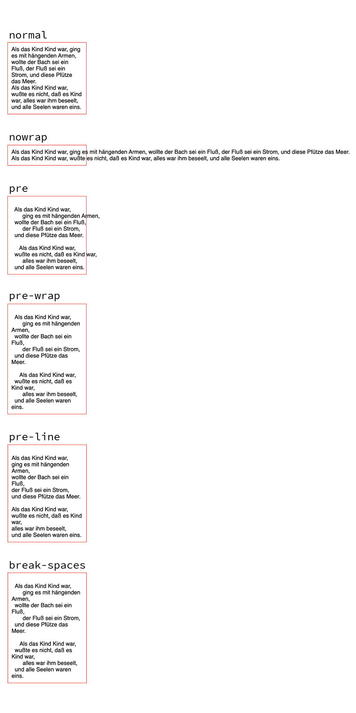

# Text Wrapping

### Line Breaking
- **Line Breaking** : The process of breaking inline-level content into lines.
- **Soft wrap break** : When a line is broken due to content wrapping (broken at *soft wrap opportunities*)
- **Forced line break** : When a line is broken due to explicit line-breaking controls, or due to the start or end of a block.
- **Soft wrap opportunity** : Word boundaries, hyphens, syllables, punctuations, spaces and more

### `line-break`
- Sets how to break lines of Korean, Chinese or Japanese text when working with punctuation and symbols.
- `auto` : Break text using the default line break rule.
- `loose` : Break text using the least restrictive line break rule.
- `normal` : Break text using the most common line break rule.
- `strict` : Break text using the most stringent line break rule.
-  `anywhere` : There is a soft wrap opportunity around every typographic character unit, including around any punctuation character or preserved white spaces, or in the middle of words, disregarding any prohibition against line breaks.

### `white-space`
- Sets how *white space* inside an element is handled.
- **White space** : A set of characters which is used to show horizontal or vertical spaces between other characters.
- `normal` : White spaces are collapsed as well as newline characters. Lines are broken as necessary to fill line boxes.
- `nowrap` : White spaces are collapsed as well as newline characters. No text wrapping.
- `pre` : White spaces are preserved. Lines are only broken at newline characters and at `<br>` elements.
- `pre-wrap` : White spaces are preserved. Lines are broken at newline characters, at `<br>`, and as necessary to fill line boxes.
- `pre-line` : White spaces are collapsed. Lines are broken at newline characters, at `<br>`, and as necessary to fill line boxes.
- `break-spaces` : Same as `pre-wrap` except:
  - White spaces always take up space, including at the end of the line. A line breaking opportunity exists even between white space characters and preserved spaces take up space and do not hang.

  ```html
  <div>
    Als das Kind Kind war,     
        ging es mit hängenden Armen,
    wollte der Bach sei ein Fluß,     
        der Fluß sei ein Strom,
    und diese Pfütze das Meer.<br>
      Als das Kind Kind war,
    wußte es nicht, daß es Kind war,     
        alles war ihm beseelt,
    und alle Seelen waren eins.     
  </div>
  ```
  