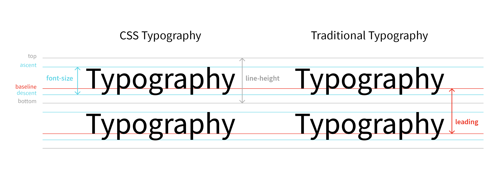
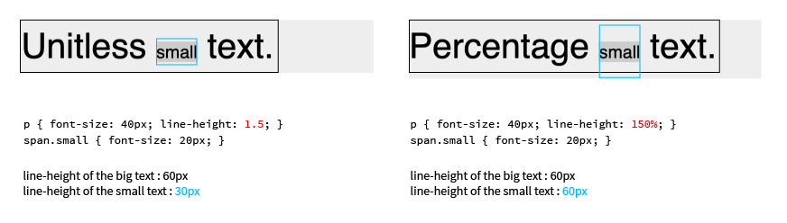

# Typography

### Font Family
```css
p { font-family: family-name, generic-family }
```
- Font family names containing whitespace should be quoted.
- Each font family name is seperated by comma.
- Always include generic family name at the end in case any given font is available (fallback). Generic family name shouldn't be quoted.
- Gemeric family names: `serif`, `sans-serif`, `monospace`, `cursive`, `fantasy`, `system-ui`, `ui-serif`, `ui-sans-serif`, `ui-monospace`, `ui-rounded`, `math`, `emoji`, `fangsong`(Chinese)
- Fallback for the fonts that only support latin alphabet:
  ```css
  p { font-family: Helvetica, Dotum, "돋움", sans-serif }
  ```
  - First, *Helvetica* will be applied to the Latin alpabets and numbers. Aftet that, *Dotum/돋움* will be applied to the Korean alpabets. You have to use both English and Korean font names for *Dotum/돋움*, in case the user's device does not support Korean.

### Capitalization
- `font-variant: small-caps` : Each letter uses its small capitalized version.
- `text-transform: capitalize;` : Turns the first letter of each word into a capital letter.
- `text-transform: uppercase;` : Turns all letters into capital letters.

### Text Overflow
- `text-overflow: clip` : The text content is clipped and not accessible (default).
- `text-overflow: ellipsis;` : The overflowing content is replaced by an ellipsis(…).

### Line hieght

```css
p { font-size: 20px; line-height: normal; }
p { font-size: 20px; line-height: 1.5; } /*line-height: 30px */
p { font-size: 20px; line-height: 1em; } /*line-height: 20px*/
p { font-size: 20px; line-height: 150%; } /*line-height: 30px*/
```
- Normal : Default value of the user agent (roughly `1.2`).
- Unitless (preferred) : Multiplied by the element's own font size.
- Length : Specified (absolute/relative) length is used.
- Percentage : Relative to the font size of the element itself. The child element inherits computed value of the parent.
- `line-height: 1.5` ≠ `line-height: 150%` 
  
