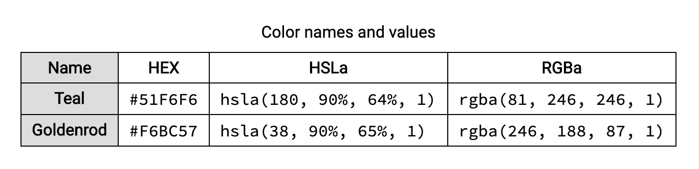

# `<table>`
>Table is comprised of rows and columns of cells containing data

### Elements that can go inside of `<table>`
- `<caption>` : Optional element specifies the caption (or title) of a table.
- `<colgroup>` : Optional elelemt defines a group of columns within a table. Useful for applying styles to entire columns.
  - `<col>` : To define different properties to a column within a `<colgroup>`, use the `<col>` tag within the `<colgroup>` tag.
- `<thead>` : A set of rows defining the head of the columns of the table. Has `<th>` elements as child elements.
- `<tbody>` : A set of table rows (`<tr>` elements), indicating that they comprise the body of the table.
- `<tfoot>` : A set of table rows summarizing the columns of the table.
- `<tr>` : A row of cells in a table. Can have `<th>` and `<td>` as child elements.
- `<th>` : A cell as header of a group of table cells.
  - `scope` : `<th>` can have `scope` attribute which defines the cells that the `<th>` element relates to. `scope` can have values such as `row`, `col`, `rowgroup`, `colgroup`.
- `<td>` : A cell of a table that contains data.
  - `headers` : `<td>` can have `headers` attribute which contains a list of space-separated strings, each corresponding to the id attribute of the `<th>` elements that apply to this element.
- Span attributes : `<th>` and `<td>` can have `colspan` and `rowspan` as attributes. These attributes contain number values that indicates for how many columns/rows the cell extends.


### Example


```html
<table>
  <caption>Color names and values</caption>
  <colgroup>
    <col class="highlight">
  </colgroup>
  <thead>
    <tr>
      <th id="name" scope="col">Name</th>
      <th id="hex" scope="col">HEX</th>
      <th id="hsla" scope="col">HSLa</th>
      <th id="rgba" scope="col">RGBa</th>
    </tr>
	</thead>
	<tbody>
    <tr>
      <th id="teal" scope="row">Teal</th>
      <td headers="teal hex">
        <code>#51F6F6</code>
      </td>
      <td headers="teal hsla">
        <code>hsla(180, 90%, 64%, 1)</code>
      </td>
      <td headers="teal rgba">
        <code>rgba(81, 246, 246, 1)</code>
      </td>
    </tr>
    <tr>
      <th id="goldenrod" scope="row">Goldenrod</th>
      <td headers="goldenrod hex">
        <code>#F6BC57</code>
      </td>
      <td headers="goldenrod hsla">
        <code>hsla(38, 90%, 65%, 1)</code>
      </td>
      <td headers="goldenrod rgba">
        <code>rgba(246, 188, 87, 1)</code>
      </td>
    </tr>
  </tbody>
</table>
```


